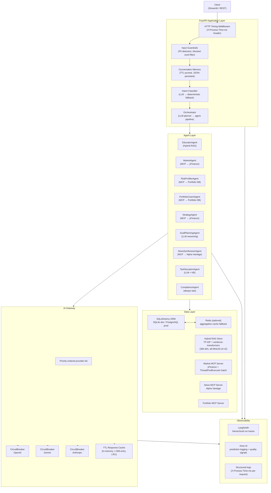
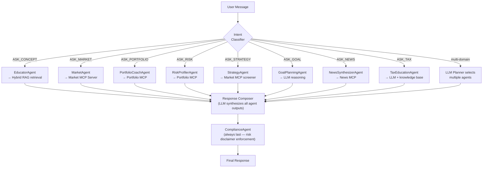
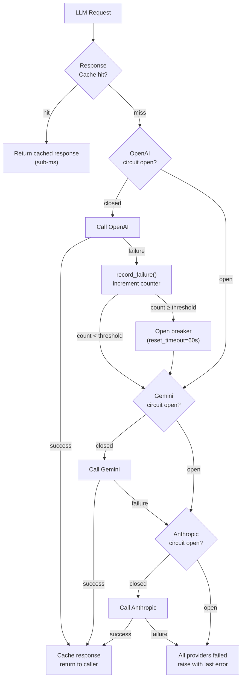
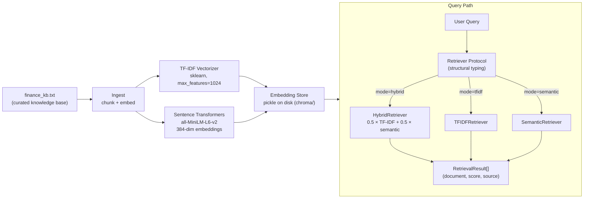
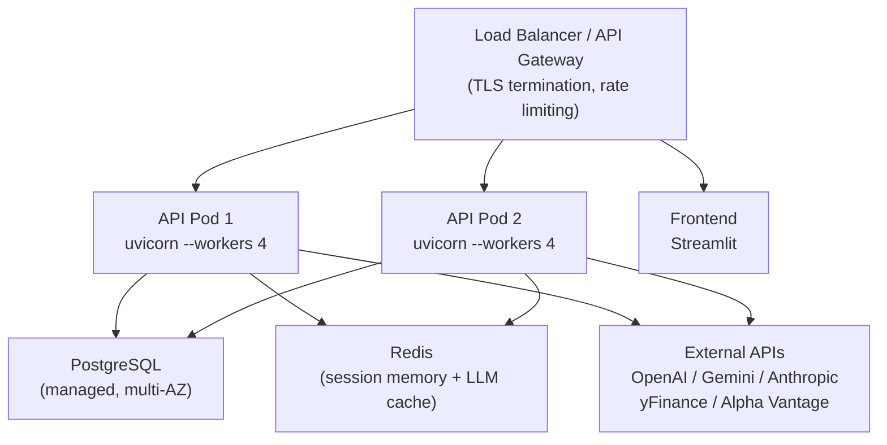




# Finnie Chat — Multi-Agent Financial AI Platform

A multi-agent AI platform for financial analysis. An LLM orchestrator classifies user intent, plans a minimal agent pipeline, and executes each agent against its appropriate data source — live market data (yFinance), a relational portfolio database, a hybrid RAG knowledge base, and a news API. A compliance agent always runs last. Every LLM call is routed through a multi-provider gateway with per-provider circuit breakers and TTL-based response caching.

**Domain coverage:** portfolio analytics · real-time market quotes · financial concept retrieval (RAG) · goal planning · tax education · news synthesis · risk profiling · strategy screening · compliance filtering

---

## Table of Contents

1. [Architecture Overview](#architecture-overview)
2. [Request Lifecycle](#request-lifecycle)
3. [Agent Orchestration Flow](#agent-orchestration-flow)
4. [Resiliency & Fallback Strategy](#resiliency--fallback-strategy)
5. [Observability & Monitoring](#observability--monitoring)
6. [Caching Strategy](#caching-strategy)
7. [RAG Engine Design](#rag-engine-design)
8. [Concurrency Considerations](#concurrency-considerations)
9. [Scalability Considerations](#scalability-considerations)
10. [Security Considerations](#security-considerations)
11. [Testing Strategy](#testing-strategy)
12. [Deployment Architecture](#deployment-architecture)
13. [Known Trade-offs & Future Work](#known-trade-offs--future-work)
14. [Performance Optimization Decisions](#performance-optimization-decisions)
15. [Failure Handling Patterns](#failure-handling-patterns)
16. [Quick Start](#quick-start)
17. [API Reference](#api-reference)
18. [Repository Structure](#repository-structure)

---

## Architecture Overview



**Key design decisions:**

| Decision | Rationale |
|---|---|
| Intent classification before orchestration | Reduces planner LLM calls by 60–80% for simple intents; provides a deterministic fallback when LLM is down |
| Per-agent MCP servers for data access | Decouples data retrieval from agent logic; each MCP server can be scaled, replaced, or mocked independently |
| Gateway-level circuit breakers | Prevents cascading failures when a provider is degraded; TTL-based half-open state avoids thundering herd on recovery |
| Protocol-based `Retriever` abstraction | Structural typing allows swapping TF-IDF, semantic, or hybrid backends without modifying calling code |
| Compliance agent always last | Enforces a single enforcement point for risk disclaimers; simplifies agent authorship (agents don't self-police) |

---

## Request Lifecycle

```mermaid
sequenceDiagram
    participant C as Client
    participant MW as HTTP Middleware
    participant GRD as Guardrails
    participant MEM as Memory
    participant IC as Intent Classifier
    participant ORCH as Orchestrator (LLM Planner)
    participant A as Selected Agents (1..N)
    participant GW as AI Gateway
    participant COMP as Response Composer
    participant COMPL as Compliance Agent

    C->>MW: POST /chat {message, conversation_id, user_id}
    MW->>GRD: validate input
    GRD-->>MW: blocked (PII) → 400 | pass → continue
    MW->>MEM: get_context(conversation_id, limit=10)
    MEM-->>MW: last N turns as plain-text context
    MW->>IC: classify_intent(message)
    Note over IC: LLM attempt first; deterministic<br/>keyword fallback if LLM fails
    IC-->>MW: intent: ASK_MARKET, risk: LOW
    MW->>ORCH: handle_message(message, context, intent)
    ORCH->>GW: call_llm(planner_prompt)  [plan which agents]
    GW-->>ORCH: ["MarketAgent", "ComplianceAgent"]
    loop for each agent in plan
        ORCH->>A: agent.run(message, user_id)
        A->>GW: call_llm(agent_prompt)  [if LLM needed]
        GW-->>A: response
        A-->>ORCH: agent_output
    end
    ORCH->>GW: call_llm(synthesis_prompt, all_agent_outputs)
    GW-->>ORCH: draft_response
    ORCH->>COMPL: compliance_run(draft_response, risk)
    COMPL-->>ORCH: final_response (+ risk disclaimer if HIGH)
    ORCH-->>MW: final_response, intent, risk
    MW->>MEM: add_message(user + assistant turns)
    MW-->>C: {reply, conversation_id, intent, risk}
    Note over MW: sets X-Process-Time-ms response header
```

**Latency profile (single-worker, no cache):**

| Stage | Typical cost |
|---|---|
| Guardrails + memory lookup | < 1 ms |
| Intent classification (LLM) | 300–800 ms |
| Planner LLM call | 400–900 ms |
| Per-agent execution (1 agent) | 500 ms–2 s (data fetch + LLM) |
| Synthesis LLM call | 600 ms–1.5 s |
| Total (single agent, no cache) | ~2–5 s end-to-end |

> Cache hits on gateway reduce LLM stages to sub-millisecond dictionary lookups. Market data aggregation cache reduces yFinance round-trips within a 5-second window.

---

## Agent Orchestration Flow



**Orchestration design notes:**

- The LLM planner runs only when intent is ambiguous or multi-domain; single-domain intents short-circuit to a deterministic plan.
- `ComplianceAgent` is structurally enforced as the final step — it is not in the planner's decision space.
- Agent outputs are keyed by domain and injected into the synthesis prompt as grounded context. The synthesis LLM is explicitly instructed not to introduce information beyond what agents provided.
- On planner failure, intent falls back to a deterministic mapping (e.g., `ASK_MARKET → [MarketAgent, ComplianceAgent]`), so the system degrades gracefully rather than returning an error.

---

## Resiliency & Fallback Strategy



**Circuit breaker parameters:**

| Parameter | Value | Rationale |
|---|---|---|
| `failure_threshold` | 5 | Tolerates transient errors before tripping |
| `reset_timeout_seconds` | 60 | Gives provider time to recover without manual intervention |
| State transitions | closed → open → auto-reset | Half-open is implicit: next request after timeout tests the provider |

**Intent classifier fallback:**

```
LLM classifier → parse JSON → valid intent/risk  [primary]
                           → parse failure        [fallback: deterministic keyword rules]
LLM unavailable            →                      [fallback: deterministic keyword rules]
```

The deterministic fallback covers 10 intent classes with priority-ordered keyword matching. It is deliberately conservative: it is tested independently and produces stable outputs without any external dependencies.

**Orchestrator fallback:**

If the planner LLM call fails or returns malformed JSON, the orchestrator falls back to a deterministic intent→agent mapping rather than returning an error to the caller.

---

## Observability & Monitoring

### LangSmith Trace Hierarchy

Every `/chat` request produces a hierarchical trace across four levels:

```
root run (chat request)
├── IntentClassifier    [chain]  inputs: message  outputs: intent, risk
├── AgentRouter         [chain]  inputs: message, intent, context  outputs: plan[]
├── {AgentName}         [chain]  (one span per agent in plan)
│   └── LLM call        [llm]    tracked via @track_llm_call decorator
└── FinalResponseComposer [chain] inputs: context_keys  outputs: draft_length
```

When `LANGSMITH_API_KEY` is absent, all `start_langsmith_run` / `end_langsmith_run` calls are no-ops — they do not log, block, or raise.

### Arize AI

When configured, Arize receives per-prediction logs including:

- `request_text`, `response_text` as features
- Quality signals: groundedness score, retrieval relevance, hallucination risk flag
- Safety tags: PII detected, restricted advice triggered, asset type

### HTTP-level metrics

The timing middleware attaches `X-Process-Time-ms` to every response and emits `http_request_duration_ms` to the `ObservabilityManager`. The `GET /metrics` endpoint exposes gateway-level counters:

```json
{
  "total_requests": 248,
  "cache_hits": 89,
  "cache_hit_rate_percent": 35.9,
  "failures": 3,
  "providers_active": 2
}
```

### Where metrics are missing (known gaps)

The following measurements should be added before treating this as production-grade:

- Per-agent p50/p95/p99 latency histograms (current: single-point timing)
- RAG retrieval quality scores exported to Arize on every EducatorAgent call
- Circuit breaker state transitions as discrete events in LangSmith or a time-series store
- Token usage per provider per request (cost attribution)
- Queue depth and worker saturation metrics under load

---

## Caching Strategy

Three independent cache layers operate at different granularities:

| Layer | Location | Key | TTL | Eviction |
|---|---|---|---|---|
| LLM response cache | `gateway.py` `RequestCache` | `model + hash(system + user)` | 3 600 s (1 h) | LRU (oldest-first, max 1 000 entries) |
| Market aggregation cache | `main.py` `_quote_agg_cache` | `sorted(symbols)` tuple | 5 s | Timestamp check on read |
| Redis (optional) | External | same as aggregation | configurable | Redis TTL |

**Cache invalidation:** TTL-based expiry only. No explicit invalidation is implemented, which is intentional for read-heavy, eventually-consistent market data.

**Known limitation:** The LLM cache key uses Python's built-in `hash()`, which is non-deterministic across processes (randomised by `PYTHONHASHSEED`). In a multi-worker deployment this means cache misses between workers for identical prompts. The correct fix is SHA-256 over the concatenated prompt bytes — tracked in [Known Trade-offs](#known-trade-offs--future-work).

---

## RAG Engine Design



**Retriever abstraction:** `Retriever` is a `Protocol` type — concrete backends (`HybridRetriever`, `TFIDFRetriever`, `SemanticRetriever`) satisfy it structurally without inheriting from a base class. Swapping backends requires no changes to calling code in agents.

**Score blending:** Hybrid retrieval computes cosine similarity from each method and blends them equally (α=0.5). Candidate sets are union-merged from both methods before ranking. This gives sparse keyword matching (TF-IDF) and semantic proximity (sentence-transformers) equal weight — appropriate for a domain where terminology is precise.

**Known limitation:** The embedding store is a pickle file on local disk. It is not shared across processes and is not suitable for horizontal scaling without a shared volume or a vector database backend (Pinecone, Weaviate, pgvector).

---

## Concurrency Considerations

**Current state:**

- FastAPI runs on Uvicorn with a single worker by default. The async event loop is used for HTTP I/O, but all LLM calls (`call_llm`) are synchronous and block the event loop. Under concurrent requests, this produces head-of-line blocking.
- The orchestrator executes agents **sequentially** even when agents are independent (e.g., `MarketAgent` and `EducatorAgent` do not share state). Sequential execution adds latency proportional to the number of agents in the plan.
- `CircuitBreaker` is not thread-safe — no locking around `_failure_count` mutations.
- `ConversationMemory` is stored in a process-local Python dict. Multiple Uvicorn workers would each maintain separate memory states, breaking conversation continuity across requests.

**Planned improvements (tracked below):**

1. Wrap `call_llm` in `asyncio.to_thread()` to avoid blocking the event loop
2. Execute independent agents concurrently with `asyncio.gather()`
3. Add `threading.Lock()` to `CircuitBreaker._failure_count`
4. Move `ConversationMemory` to Redis for cross-worker session consistency

---

## Scalability Considerations

**Stateless API (with caveats):** The FastAPI application is stateless at the HTTP layer. Portfolio data lives in PostgreSQL (configurable via `DATABASE_URL`). The LLM gateway and memory are in-process globals — see [Concurrency Considerations](#concurrency-considerations) for the implications.

**Horizontal scaling path:**

```
Load Balancer
├── API Worker 1  ──┐
├── API Worker 2  ──┼── PostgreSQL (shared portfolio data)
└── API Worker N  ──┘── Redis (shared LLM response cache + conversation memory)
                        External: OpenAI / Gemini / Anthropic
                        External: yFinance / Alpha Vantage
```

The blocking path to horizontal scaling is the in-process `ConversationMemory` and `RequestCache`. Both need to be externalised to Redis before running more than one worker.

**MCP server scaling:** Market and News MCP servers are in-process. Under high load, the `ThreadPoolExecutor` in the batch quote tool (`max_workers=min(8, len(tickers))`) provides parallelism for outbound yFinance calls, but the server itself is not independently scalable. Extracting MCP servers to separate FastAPI services would allow independent scaling.

---

## Security Considerations

**Current state (known gaps):**

| Area | Current | Required for production |
|---|---|---|
| Authentication | None — any `user_id` string is accepted | Bearer token or API key validation |
| Authorization | None | Per-user resource scoping |
| Rate limiting | None | Per-IP and per-user request quotas |
| Secret storage | Brokerage tokens stored as plaintext in DB columns | Envelope encryption (AWS KMS, Vault) |
| Input validation | Keyword blocklist (2 terms: `ssn`, `account number`) | Regex PII patterns + semantic safety classifier |
| HTTPS | Not configured in deploy scripts | TLS termination at load balancer or reverse proxy |
| Dependency scanning | None | Dependabot or `pip-audit` in CI |

**Guardrails architecture (current):** `input_guardrails()` is a 15-line function with a two-term blocklist. `output_guardrails()` prepends a disclaimer for `HIGH`-risk responses. These are functional placeholders. A production guardrails layer would apply:

- Regex-based PII detection (SSN, credit card, phone, email patterns)
- A semantic safety classifier to catch prompt injection and out-of-domain advice requests
- Output content filtering before returning to the client

---

## Testing Strategy

**Test coverage by layer:**

| Layer | Count (approx.) | Approach |
|---|---|---|
| Unit — gateway, circuit breaker, cache | ~40 | Mocked LLM clients; tests circuit state machine directly |
| Unit — RAG retrieval, score blending | ~30 | In-memory document store; no disk I/O |
| Unit — intent classifier | ~25 | Deterministic fallback tested in isolation; `PYTEST_CURRENT_TEST` env bypasses LLM |
| Unit — agents | ~120 | Each agent mocked at LLM boundary; data sources stubbed |
| Integration — database & sync | ~40 | SQLite in-memory; provider sync round-trip |
| Integration — MCP servers | ~30 | yFinance mocked; asserts on response schema |
| LLM evaluation — DeepEval | 12 | ExactMatch, Faithfulness, and Answer Relevancy metrics; requires live keys |

```bash
# Run full suite (no live keys required)
pytest tests/ -q

# Run in parallel
pytest tests/ -n auto

# Run with coverage
pytest tests/ --cov=app --cov-report=term-missing

# LLM evaluation (requires OPENAI_API_KEY + DEEPEVAL_API_KEY)
pytest tests/deepeval/ -v
```

**Test isolation:** All observability integrations are no-ops during tests. External APIs (yFinance, Alpha Vantage, OpenAI) are mocked at the HTTP client level. The intent classifier detects `PYTEST_CURRENT_TEST` to bypass the LLM call — this avoids flaky test-ordering issues but also means the LLM classifier path is not covered by the unit suite. A targeted integration test for the LLM classifier path is a known gap.

**DeepEval test matrix:**

| Test | Metric | Notes |
|---|---|---|
| Educator concept accuracy | Faithfulness | RAG output grounded in knowledge base |
| Market quote formatting | ExactMatch | Ticker, price, change_pct fields present |
| Compliance disclaimer | Answer Relevancy | HIGH-risk response includes disclaimer |

---

## Deployment Architecture

**Current (single-host, systemd):**

```
systemd
├── finnie-backend.service   →  uvicorn app.main:app --port 8000
└── finnie-frontend.service  →  streamlit run frontend/Home.py --port 8501
```

**Target (containerised, cloud-native):**



**Missing infrastructure (tracked in roadmap):**
- `Dockerfile` and `docker-compose.yml` for local parity
- Kubernetes manifests or Helm chart for the target architecture
- GitHub Actions CI pipeline (lint, test, build, scan)
- Alembic migration files for schema evolution

---

## Known Trade-offs & Future Work

These are documented engineering debts, not undiscovered bugs.

### Active trade-offs

| Trade-off | Current choice | Implication |
|---|---|---|
| In-process `ConversationMemory` | Simple; no Redis dependency | Broken across multiple workers |
| `hash()` for cache keys | Less code | Non-deterministic across processes; fix: SHA-256 |
| Sequential agent execution | Simpler error handling | Adds latency when plan has independent agents |
| `CircuitBreaker` without locking | No `threading.Lock` import | Race condition under concurrent requests |
| Plaintext brokerage tokens in DB | Faster iteration | Must encrypt before handling real credentials |
| No authentication | Easier local development | Blocks any multi-user deployment |
| `declarative_base()` (deprecated in SQLAlchemy 2) | Minimal migration effort | Should migrate to `DeclarativeBase` class |
| Emoji in log messages | Readable in development | Breaks structured log parsing in production |
| `PYTEST_CURRENT_TEST` check in `intent.py` | Deterministic tests | Test-environment state leaks into production code |
| Mock portfolio data in agents | Enables demo without DB | Disconnects agent output from real user holdings |

### Roadmap

**High priority (required for multi-user deployment):**
- [ ] Replace `ConversationMemory` with Redis-backed session store
- [ ] Add Bearer token authentication to all API endpoints
- [ ] Implement rate limiting middleware (per-IP, per-user)
- [ ] Configure Alembic migrations and run against PostgreSQL
- [ ] Wire `portfolio_mcp_db.py` to agents (replace mock MCP)
- [ ] SHA-256 cache keys in `RequestCache`
- [ ] Add `threading.Lock` to `CircuitBreaker`

**Medium priority (production hardening):**
- [ ] Make `call_llm` async (`asyncio.to_thread` or full async gateway)
- [ ] Concurrent agent execution via `asyncio.gather` for independent plan steps
- [ ] Structured JSON logging (`python-json-logger` or `structlog`)
- [ ] Prometheus `/metrics` endpoint (counter, histogram, gauge types)
- [ ] Docker Compose for local development
- [ ] GitHub Actions CI pipeline (test → lint → build → container scan)
- [ ] Expand guardrails: regex PII patterns, semantic safety classifier

**Lower priority (quality and scale):**
- [ ] Streaming responses for long-form agent output
- [ ] Vector database backend for RAG (pgvector or Weaviate)
- [ ] Per-agent latency histograms exported to time-series store
- [ ] Token usage tracking per provider (cost attribution)
- [ ] Load testing baseline with k6 or Locust

---

## Performance Optimization Decisions

**Lazy model loading:** The `all-MiniLM-L6-v2` sentence-transformer model is loaded only when a semantic retrieval query is first executed. This avoids a ~500 ms model load penalty on startup at the cost of a slow first retrieval. In production, a startup warmup call is preferable.

**Batch ticker fetching:** `GetQuotesTool` uses `yf.Tickers(symbols)` for a single batch download, then parallelises per-ticker info extraction with `ThreadPoolExecutor(max_workers=min(8, N))`. This reduces round-trips to yFinance for multi-ticker queries.

**Short-TTL aggregation cache:** The 5-second market quote cache deduplicates burst requests for the same ticker set (e.g., a user rapidly refreshing the portfolio page) without serving stale data for meaningful time windows.

**LLM response cache:** Identical system+user prompt pairs hit the in-memory cache, reducing latency to sub-millisecond and eliminating API cost for repeated questions. The 1-hour TTL is intentionally long for educational content (stable) and intentionally not applied to market data (agents call yFinance directly; LLM synthesis re-runs on fresh data).

---

## Failure Handling Patterns

**Gateway exhaustion:** When all providers have open circuit breakers, `call_llm` raises `Exception("All LLM providers failed")`. The orchestrator catches this in the synthesis step and constructs a grounded fallback response from raw agent outputs (no LLM synthesis). The compliance agent still runs.

**Observability degradation:** All `start_langsmith_run` / `end_langsmith_run` calls are wrapped in `try/except` and return `None` on failure. The observability system is structurally incapable of blocking a response path.

**RAG cold start:** If the embedding store pickle does not exist (first run, or after a clean checkout), `load_documents()` silently returns empty state. The first RAG query returns "No documents available" and the EducatorAgent falls back to LLM synthesis without retrieved context. Ingestion must be run explicitly: `python scripts/ingest_kb.py`.

**Database connectivity:** If the database is unreachable at startup, `init_db()` will raise immediately and fail the process — a loud, intentional failure. Portfolio endpoints gracefully return empty results when the user record does not exist.

**yFinance partial failures:** The batch quote tool returns partial results when individual tickers fail. Failed tickers return `{"price": null, "error": "<message>"}` — the API does not propagate a 500 for partial data. Agents handle `None` prices by omitting that ticker from their analysis.

---

## Quick Start

### Prerequisites

- Python 3.11+
- OpenAI API key (minimum; Gemini and Anthropic keys optional for fallback providers)

### Install

```bash
git clone https://github.com/avinash2196/finnie-chat.git
cd finnie-chat

python -m venv venv
source venv/bin/activate       # macOS / Linux
# .\venv\Scripts\Activate.ps1  # Windows

pip install -r requirements.txt
pip install streamlit            # frontend dependency, not in requirements.txt
```

### Configure

```bash
# Minimum viable configuration
echo "OPENAI_API_KEY=sk-proj-..." > .env

# Optional: additional LLM providers (fallback chain)
echo "GEMINI_API_KEY=your-key" >> .env
echo "ANTHROPIC_API_KEY=sk-ant-..." >> .env

# Optional: observability integrations (safe no-ops when absent)
echo "LANGSMITH_API_KEY=lsv2_pt_..." >> .env
echo "LANGSMITH_PROJECT=finnie-chat" >> .env
echo "ARIZE_API_KEY=your-arize-key" >> .env
echo "ARIZE_SPACE_KEY=your-space-key" >> .env

# Optional: Redis aggregation cache
echo "REDIS_URL=redis://localhost:6379/0" >> .env
```

### Initialise

```bash
# Create database tables
python -c "from app.database import init_db; init_db()"

# Ingest knowledge base into RAG store
python -m app.rag.ingest
```

### Run

```bash
# Start both services (backend :8000, frontend :8501)
./start.sh        # macOS / Linux
.\start.bat       # Windows

# Or individually
uvicorn app.main:app --port 8000 --reload
streamlit run frontend/Home.py
```

| Service | URL |
|---|---|
| REST API | http://localhost:8000 |
| OpenAPI docs | http://localhost:8000/docs |
| Liveness probe | http://localhost:8000/health |
| Readiness probe | http://localhost:8000/ready |
| Streamlit UI | http://localhost:8501 |

---

## API Reference

### Chat

```bash
# Single-turn
curl -X POST http://localhost:8000/chat \
  -H "Content-Type: application/json" \
  -d '{"message": "What is a Roth IRA?", "user_id": "user_001"}'

# Response
{
  "reply": "A Roth IRA is an individual retirement account funded with after-tax dollars...",
  "conversation_id": "550e8400-e29b-41d4-a716-446655440000",
  "intent": "ASK_TAX",
  "risk": "MED"
}

# Multi-turn (pass conversation_id to maintain context)
curl -X POST http://localhost:8000/chat \
  -H "Content-Type: application/json" \
  -d '{"message": "How does it compare to a traditional IRA?",
       "conversation_id": "550e8400-e29b-41d4-a716-446655440000",
       "user_id": "user_001"}'
```

### Market

```bash
curl -X POST http://localhost:8000/market/quote \
  -H "Content-Type: application/json" \
  -d '{"symbols": ["AAPL", "MSFT"]}'
```

### Portfolio

```bash
curl http://localhost:8000/users/user_001/analytics
```

### Gateway metrics

```bash
curl http://localhost:8000/metrics
# {
#   "total_requests": 248,
#   "cache_hits": 89,
#   "cache_hit_rate_percent": 35.9,
#   "failures": 3,
#   "providers_active": 2
# }
```

### Observability status

```bash
curl http://localhost:8000/observability/status
```

---

## Repository Structure

```
finnie-chat/
├── app/
│   ├── main.py              # FastAPI application, all endpoints, middleware
│   ├── gateway.py           # Multi-provider LLM gateway (circuit breaker, cache)
│   ├── intent.py            # Intent + risk classification (LLM → deterministic fallback)
│   ├── llm.py               # Thin call_llm() wrapper over gateway
│   ├── memory.py            # Conversation memory (in-process dict, file persistence)
│   ├── database.py          # SQLAlchemy models: User, Holding, Transaction, Snapshot, SyncLog
│   ├── providers.py         # PortfolioProvider ABC: Mock / Robinhood / Fidelity
│   ├── sync_tasks.py        # Background portfolio sync scheduler (asyncio)
│   ├── observability.py     # LangSmith + Arize AI integration (safe no-ops)
│   ├── guardrails.py        # Input PII check, output risk-level filter
│   ├── env.py               # .env loader (called once at startup)
│   ├── portfolio_mcp_db.py  # DB-backed portfolio MCP server (not yet wired to agents)
│   ├── agents/
│   │   ├── orchestrator.py  # LLM planner + sequential agent dispatch + synthesis
│   │   ├── educator.py      # EducatorAgent — hybrid RAG retrieval
│   │   ├── market.py        # MarketAgent — market MCP client
│   │   ├── risk_profiler.py # RiskProfilerAgent — volatility, Sharpe, concentration
│   │   ├── portfolio_coach.py # PortfolioCoachAgent — diversification scoring
│   │   ├── strategy.py      # StrategyAgent — dividend / growth / value screener
│   │   ├── compliance.py    # ComplianceAgent — risk disclaimers, HIGH-risk blocking
│   │   ├── goal_planning.py # GoalPlanningAgent — savings targets, milestones
│   │   ├── news_synthesizer.py # NewsSynthesizerAgent — Alpha Vantage + ticker extraction
│   │   └── tax_education.py # TaxEducationAgent — IRA, 401k, capital gains
│   ├── mcp/
│   │   ├── market_server.py # Market MCP: yFinance with ThreadPoolExecutor batch fetch
│   │   ├── market.py        # Market MCP client wrapper
│   │   ├── portfolio.py     # Portfolio MCP server (mock data — see portfolio_mcp_db.py)
│   │   ├── news_server.py   # News MCP: Alpha Vantage with ticker filtering + fallback
│   │   └── news.py          # News MCP client wrapper
│   └── rag/
│       ├── store.py         # Embedding store: TF-IDF + sentence-transformers (pickle)
│       ├── retriever.py     # Protocol-based retriever: Hybrid / TF-IDF / Semantic
│       ├── ingest.py        # Knowledge base ingestion pipeline
│       └── verification.py  # Retrieval scoring + source attribution
├── frontend/
│   ├── Home.py              # Streamlit entry point
│   └── pages/               # Chat, Portfolio, Market, About pages
├── data/
│   └── finance_kb.txt       # Curated financial knowledge base (source for RAG)
├── tests/                   # 453 tests: unit / integration / deepeval / manual
├── deploy/                  # systemd unit files + startup scripts
├── scripts/                 # DB utilities, RAG ingestion, improvement scripts
├── tools/                   # Benchmarking and profiling utilities
├── docs/                    # Architecture docs, implementation notes, planning
├── requirements.txt
├── pytest.ini
└── start.sh / start.bat     # One-command backend + frontend startup
```

---

## Positioning for Specific Roles

### AI Infrastructure / AI Platform Engineering

Relevant signals: multi-provider LLM gateway with circuit breakers, Protocol-based retriever abstraction, MCP server architecture for data decoupling, TTL-based response caching, LangSmith hierarchical trace integration, Arize AI prediction logging. Emphasise the gateway design and the observability integration when discussing this with interviewers.

### Distributed Systems Engineering

Relevant signals: provider factory pattern, background sync scheduler, async portfolio sync with SQLAlchemy, Redis-backed aggregation cache with in-process fallback, ThreadPoolExecutor for parallel ticker fetching. Be prepared to discuss the known concurrency limitations (sequential agent execution, non-thread-safe circuit breaker) and the migration path to async.

### ML Platform / MLOps

Relevant signals: hybrid RAG with score blending across two retrieval methods, DeepEval LLM quality evaluation suite, Arize AI prediction monitoring, deterministic fallback for intent classification, structured knowledge base ingestion pipeline. Emphasise the retriever abstraction (swappable backends) and the LLM evaluation layer.

---

## Further Reading

| Document | Purpose |
|---|---|
| [Architecture & Data Flow](docs/architecture/ARCHITECTURE.md) | Full request pipeline, agent coordination, flowcharts |
| [AI Gateway Design](docs/architecture/GATEWAY.md) | LLM routing, circuit-breaker mechanics, caching, provider config |
| [Database Guide](docs/architecture/DATABASE_GUIDE.md) | SQLAlchemy models, provider pattern, DB-backed MCP variant |
| [Observability Guide](docs/architecture/OBSERVABILITY.md) | LangSmith + Arize setup, trace hierarchy |
| [Test Coverage](docs/testing/TEST_COVERAGE.md) | Per-module breakdown of all 453 tests |
| [Performance Roadmap](docs/PERFORMANCE_ROADMAP.md) | Latency targets, bottleneck analysis, planned optimisations |

---

## License

MIT — see `LICENSE` for details.