# Chat Tab Architecture

## Overview
The Chat Tab is the main conversational interface where users ask questions about finance, get explanations, and receive personalized advice.

---

## Chat Tab Flow Diagram

```mermaid
flowchart LR
    subgraph CHAT_UI["💬 Chat Tab UI"]
        UMSG["User Message Input"]
        CHATVIEW["Chat Output View"]
    end

    UMSG -->|sends query| API["🔌 Backend API"]
    
    API --> ORCH["🧠 LLM Orchestrator<br/>━━━━━━━━━━<br/>• Intent Router<br/>• Memory Lookup<br/>• Tool Selection"]
    
    ORCH <--->|read/write| MEM["💾 Memory Store<br/>━━━━━━━━━━<br/>• User Profile<br/>• Chat History<br/>• Goals & Risk Level"]

    ORCH -->|educational query| EDU["📚 Educator Agent<br/>(Explain Concepts)"]
    ORCH -->|market context| MKTAN["📈 Market Analyst Agent"]
    ORCH -->|strategy query| STRAT["🎯 Strategy Agent"]

    EDU --> RAG["🔍 RAG Engine<br/>(Vector DB + KB)"]
    STRAT --> RAG
    MKTAN --> MKTAPI["📊 Market Data API"]

    EDU -->|results| ORCH
    MKTAN -->|results| ORCH
    STRAT -->|results| ORCH

    ORCH --> COMP["🛡️ Compliance Agent<br/>(Safety Filter)"]
    COMP -->|validated response| API
    API -->|formatted answer| CHATVIEW

    style CHAT_UI fill:#E3F2FD,stroke:#1976D2,stroke-width:2px
    style UMSG fill:#BBDEFB,stroke:#1565C0
    style CHATVIEW fill:#BBDEFB,stroke:#1565C0
    style API fill:#C8E6C9,stroke:#388E3C,stroke-width:2px
    style ORCH fill:#FFE0B2,stroke:#F57C00,stroke-width:2px,color:#000
    style MEM fill:#4ECDC4,stroke:#1A8A80,stroke-width:2px,color:#fff
    style EDU fill:#A8E6CF,stroke:#56B49F
    style MKTAN fill:#FFAAA5,stroke:#FF8877,color:#fff
    style STRAT fill:#95B8D1,stroke:#547AA5
    style RAG fill:#F8BBD0,stroke:#E91E63,color:#fff
    style MKTAPI fill:#F8BBD0,stroke:#E91E63,color:#fff
    style COMP fill:#EAC4D5,stroke:#D47BA0
```

---

## Key Components

| Component | Purpose | Example Use Cases |
|-----------|---------|-------------------|
| **Chat UI** | User input/output interface | Ask questions, view responses |
| **Orchestrator** | Routes intent to appropriate agents | Determine if query is educational or market-related |
| **Memory Store** | Maintains context across messages | Remember user's risk profile, past questions |
| **Educator Agent** | Explains financial concepts | "What is portfolio diversification?" |
| **Market Analyst** | Provides market data & trends | "What are today's top movers?" |
| **Strategy Agent** | Suggests investment strategies | "Show me dividend stocks similar to my portfolio" |
| **RAG Engine** | Knowledge base search | Pulls relevant docs from financial knowledge base |
| **Compliance Agent** | Filters unsafe advice | Blocks specific stock recommendations |

---

## Data Flow Sequence

---

## Response Generation Process

1. **User Input** → Chat captures question
2. **Intent Detection** → Orchestrator analyzes what type of query
3. **Context Loading** → Memory store provides user profile & history
4. **Agent Dispatch** → Appropriate agents are called (Educator, Analyst, Strategy, etc.)
5. **Data Retrieval** → Agents query RAG, APIs, or databases
6. **Response Fusion** → Orchestrator combines agent responses
7. **Safety Check** → Compliance agent filters the response
8. **Formatting** → API formats response with explanations
9. **Display** → Chat UI shows formatted answer to user

