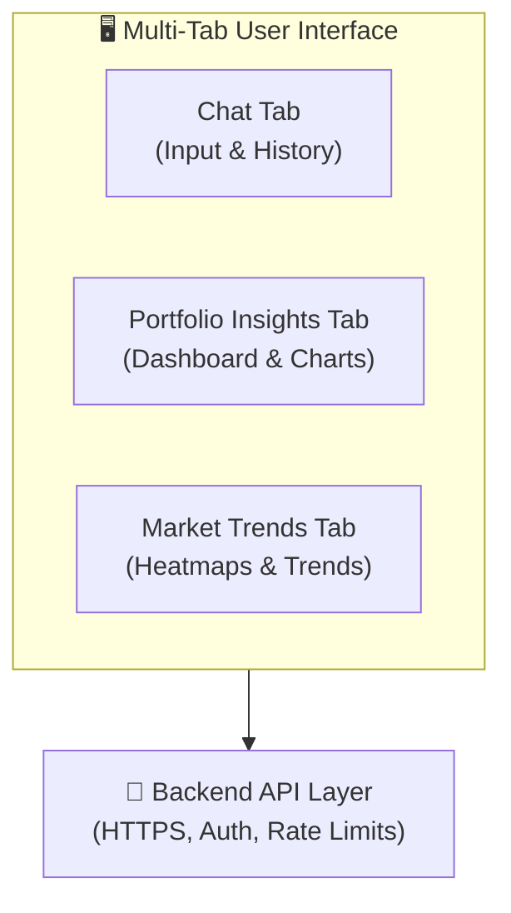
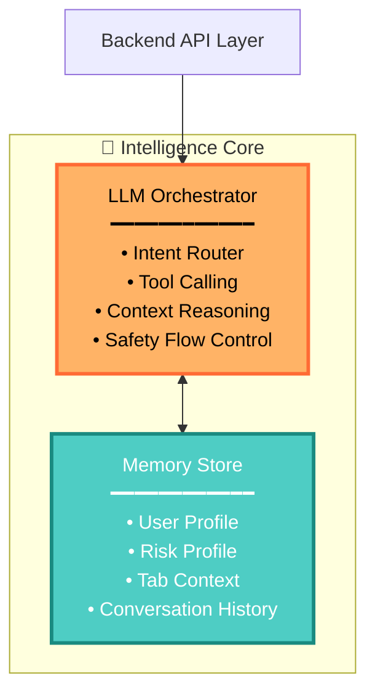
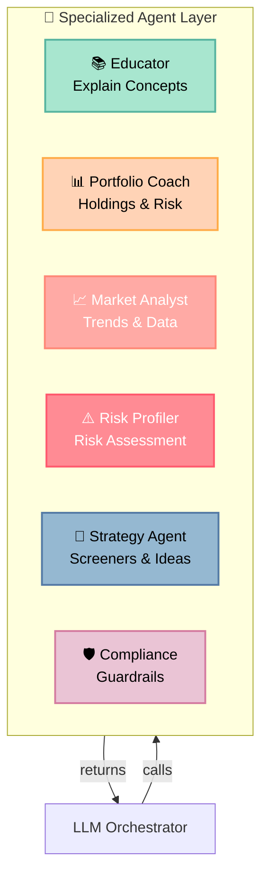
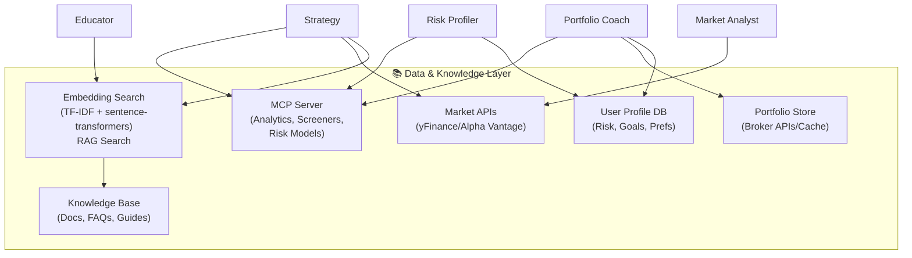
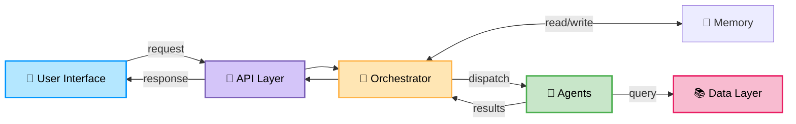
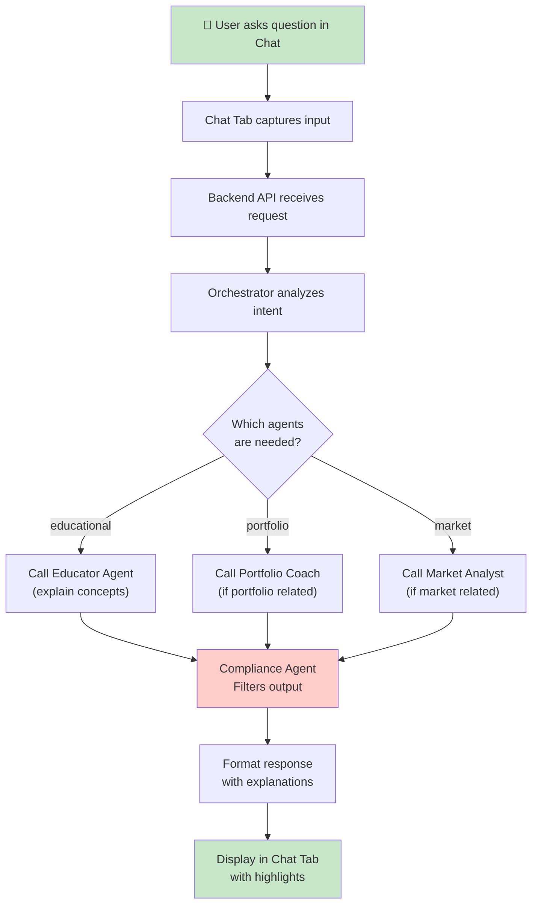

# Financial AI Assistant Architecture

> ⚠️ **Archived document** — reflects an earlier development stage and not the current implementation state. Technology choices shown (e.g. vector DB options, UI framework proposals) are planning-stage candidates; see `docs/architecture/ARCHITECTURE.md` for the actual implementation.

---

## 1. User Interface Layer

```mermaid
flowchart TB
    subgraph UI["🖥️ Multi-Tab User Interface"]
        CHAT["Chat Tab<br/>(Input & History)"]
        PORT["Portfolio Insights Tab<br/>(Dashboard & Charts)"]
        MKT["Market Trends Tab<br/>(Heatmaps & Trends)"]
    end

    UI --> API["🔌 Backend API Layer<br/>(HTTPS, Auth, Rate Limits)"]
```

---

## 2. Core Orchestration Layer

```mermaid
flowchart TB
    API["Backend API Layer"]
    
    subgraph CORE["🧠 Intelligence Core"]
        ORCH["LLM Orchestrator<br/>━━━━━━━━━━━━<br/>• Intent Router<br/>• Tool Calling<br/>• Context Reasoning<br/>• Safety Flow Control"]
        MEM["Memory Store<br/>━━━━━━━━━━━━<br/>• User Profile<br/>• Risk Profile<br/>• Tab Context<br/>• Conversation History"]
    end

    API --> ORCH
    ORCH <--> MEM
    
    style ORCH fill:#FFB366,stroke:#FF6B35,stroke-width:3px,color:#000
    style MEM fill:#4ECDC4,stroke:#1A8A80,stroke-width:3px,color:#fff
```

---

## 3. Specialized Agents

```mermaid
flowchart TB
    ORCH["LLM Orchestrator"]
    
    subgraph AGENTS["🤖 Specialized Agent Layer"]
        direction LR
        EDU["📚 Educator<br/>Explain Concepts"]
        PORTC["📊 Portfolio Coach<br/>Holdings & Risk"]
        MKTAN["📈 Market Analyst<br/>Trends & Data"]
        RISK["⚠️ Risk Profiler<br/>Risk Assessment"]
        STRAT["🎯 Strategy Agent<br/>Screeners & Ideas"]
        COMP["🛡️ Compliance<br/>Guardrails"]
    end

    ORCH -->|calls| AGENTS
    AGENTS -->|returns| ORCH
    
    style EDU fill:#A8E6CF,stroke:#56B49F,stroke-width:2px,color:#000
    style PORTC fill:#FFD3B6,stroke:#FFAA47,stroke-width:2px,color:#000
    style MKTAN fill:#FFAAA5,stroke:#FF8877,stroke-width:2px,color:#fff
    style RISK fill:#FF8B94,stroke:#FF5A6E,stroke-width:2px,color:#fff
    style STRAT fill:#95B8D1,stroke:#547AA5,stroke-width:2px,color:#000
    style COMP fill:#EAC4D5,stroke:#D47BA0,stroke-width:2px,color:#000
```

---

## 4. Data & Knowledge Layer

```mermaid
flowchart TB
    subgraph DATA["📚 Data & Knowledge Layer"]
        direction TB
        KB["Knowledge Base<br/>(Docs, FAQs, Guides)"]
        VDB["Embedding Search<br/>(TF-IDF + sentence-transformers)<br/>RAG Search"]
        PROF["User Profile DB<br/>(Risk, Goals, Prefs)"]
        PDATA["Portfolio Store<br/>(Broker APIs/Cache)"]
        MKTAPI["Market APIs<br/>(yFinance/Alpha Vantage)"]
        MCP["MCP Server<br/>(Analytics, Screeners,<br/>Risk Models)"]
    end

    EDU["Educator"] --> VDB
    STRAT["Strategy"] --> VDB
    VDB --> KB
    
    PORTC["Portfolio Coach"] --> PROF
    RISK["Risk Profiler"] --> PROF
    PORTC --> PDATA
    
    MKTAN["Market Analyst"] --> MKTAPI
    STRAT --> MKTAPI
    
    PORTC --> MCP
    STRAT --> MCP
    RISK --> MCP
```

---

## 5. Complete Data Flow

```mermaid
flowchart LR
    UI["👤 User Interface"]
    API["🔌 API Layer"]
    ORCH["🧠 Orchestrator"]
    MEM["💾 Memory"]
    AGENTS["🤖 Agents"]
    DATA["📚 Data Layer"]
    
    UI -->|request| API
    API --> ORCH
    ORCH <--->|read/write| MEM
    ORCH -->|dispatch| AGENTS
    AGENTS -->|query| DATA
    AGENTS -->|results| ORCH
    ORCH --> API
    API -->|response| UI
    
    style UI fill:#B4E7FF,stroke:#0096FF,stroke-width:2px,color:#000
    style API fill:#D4C5F9,stroke:#7B5FB8,stroke-width:2px,color:#000
    style ORCH fill:#FFE6B4,stroke:#FFB347,stroke-width:2px,color:#000
    style AGENTS fill:#C8E6C9,stroke:#4CAF50,stroke-width:2px,color:#000
    style DATA fill:#F8BBD0,stroke:#E91E63,stroke-width:2px,color:#000
```

---

## 6. Request Flow Example: Chat Query

```mermaid
flowchart TD
    USER["👤 User asks question in Chat"]
    
    CHAT["Chat Tab captures input"]
    
    API["Backend API receives request"]
    
    ORCH["Orchestrator analyzes intent"]
    
    ROUTE{Which agents<br/>are needed?}
    
    EDU["Call Educator Agent<br/>(explain concepts)"]
    PORTC["Call Portfolio Coach<br/>(if portfolio related)"]
    MKTAN["Call Market Analyst<br/>(if market related)"]
    
    COMP["Compliance Agent<br/>Filters output"]
    
    RESPONSE["Format response<br/>with explanations"]
    
    DISPLAY["Display in Chat Tab<br/>with highlights"]
    
    USER --> CHAT --> API --> ORCH --> ROUTE
    ROUTE -->|educational| EDU
    ROUTE -->|portfolio| PORTC
    ROUTE -->|market| MKTAN
    EDU --> COMP
    PORTC --> COMP
    MKTAN --> COMP
    COMP --> RESPONSE --> DISPLAY
    
    style USER fill:#c8e6c9
    style DISPLAY fill:#c8e6c9
    style COMP fill:#ffcccc
```

---

## Architecture Summary

| Layer | Components | Purpose |
|-------|-----------|---------|
| **UI** | Chat, Portfolio, Market Tabs | User interaction |
| **API** | REST/WebSocket endpoints | Request handling |
| **Orchestration** | LLM Orchestrator + Memory | Intent routing & context |
| **Agents** | 6 specialized agents | Domain-specific tasks |
| **Data** | DBs, APIs, MCP Server | Knowledge & data access |
| **QA** | Tests, Monitoring | Quality & observability |
