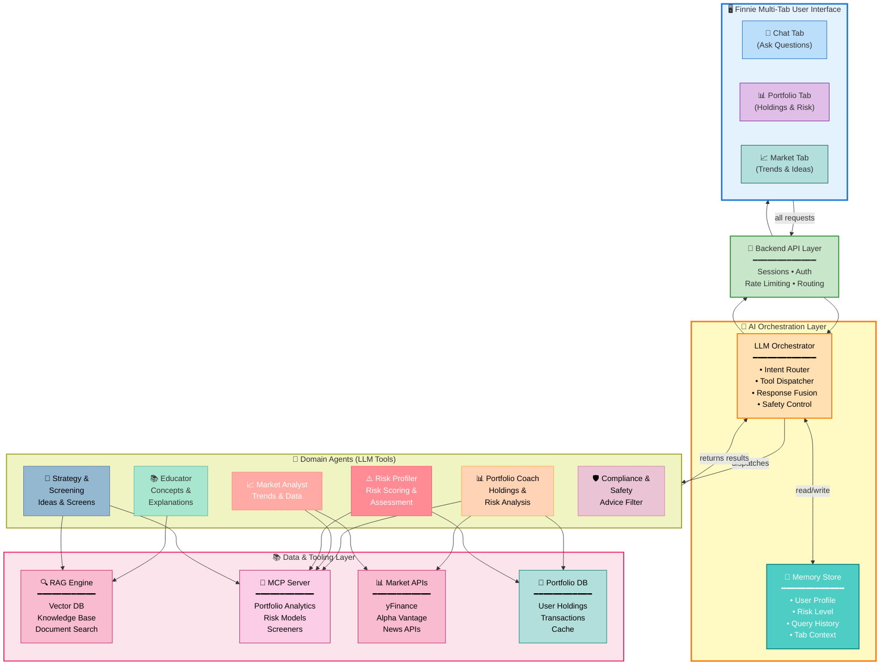
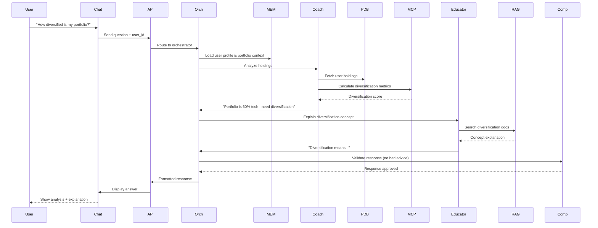
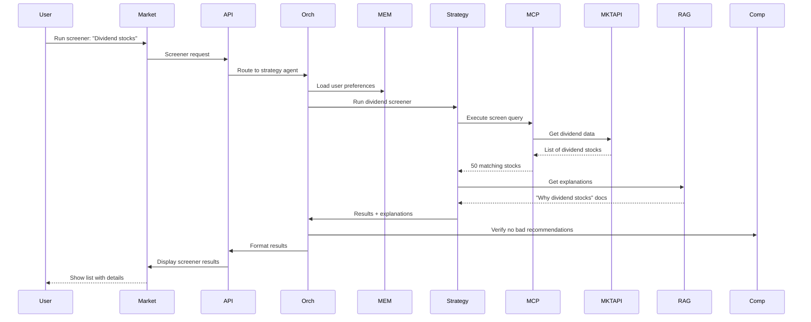
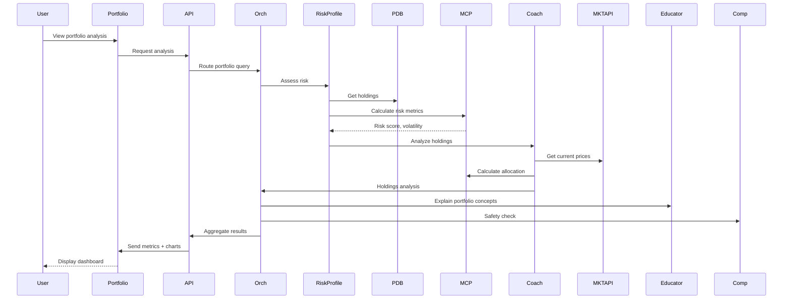

# High-Level System Architecture

## Complete System Overview

The Finnie Financial AI system is a multi-tab AI assistant that integrates specialized agents, real-time market data, portfolio analytics, and educational content to provide personalized financial guidance.

---

## Complete Architecture Diagram

---

## System Layers Explained

### Layer 1: User Interface
Three specialized tabs for different user needs:

| Tab | Purpose | Features |
|-----|---------|----------|
| **Chat** | General Q&A about finance | Ask anything, get explanations, market context |
| **Portfolio** | Personal investment analysis | View holdings, risk metrics, diversification |
| **Market** | Explore market opportunities | Trends, screeners, sector analysis, ideas |

### Layer 2: Backend API
- Session management & authentication
- Request routing to orchestrator
- Response formatting & aggregation
- Rate limiting & caching

### Layer 3: AI Orchestration
**Orchestrator** - LLM-based decision maker:
- Analyzes user intent
- Routes to appropriate agents
- Manages multi-agent conversations
- Fuses responses from multiple agents
- Enforces safety & compliance

**Memory Store** - Context persistence:
- User profile (risk level, goals, knowledge)
- Conversation history
- Tab-specific context
- Previous queries & results

### Layer 4: Domain Agents (6 Specialized Tools)

Each agent is a specialized LLM tool:

| Agent | Specialization | Uses |
|-------|----------------|------|
| **Educator** | Financial education | RAG, Knowledge Base |
| **Portfolio Coach** | Portfolio analysis | Portfolio DB, Market APIs, MCP |
| **Market Analyst** | Market trends | Market APIs, MCP |
| **Risk Profiler** | Risk assessment | MCP, Portfolio DB |
| **Strategy & Screening** | Investment ideas | MCP, RAG |
| **Compliance** | Safety filtering | Safety rules, guardrails |

### Layer 5: Data & Tooling
External systems providing data & analytics:

| Tool | Purpose | Data |
|------|---------|------|
| **RAG Engine** | Knowledge retrieval | Financial docs, guides, FAQs |
| **MCP Server** | Analytics & metrics | Risk models, screeners, analysis |
| **Market APIs** | Real-time prices & news | Stock data, indices, news |
| **Portfolio DB** | User holdings storage | Assets, transactions, history |

---

## Complete Data Flow Examples

### Example 1: Chat Question about Diversification

### Example 2: Market Tab - Stock Screener

### Example 3: Portfolio Tab - Risk Assessment

---

## Key Features by Tab

### Chat Tab ✨
- Real-time conversational AI
- Educational content from RAG
- Market context integration
- Personalized by user risk profile

### Portfolio Tab 📊
- Real-time holdings valuation
- Risk metrics & analytics
- Diversification analysis
- Sector breakdown visualization

### Market Tab 📈
- Live market indices
- Sector performance heatmap
- Custom stock screeners
- Investment strategy ideas

---

## Technical Highlights

✅ **Multi-Agent Architecture** - Specialized agents for different domains
✅ **Memory & Context** - Maintains user state across sessions
✅ **RAG Integration** - Knowledge-based document search
✅ **MCP Server** - Advanced analytics & modeling
✅ **Real-time Data** - Live market APIs integration
✅ **Safety First** - Compliance agent filters all advice
✅ **Modular Design** - Easy to add new agents/data sources

