# Market Trends Tab Architecture

## Overview
The Market Trends Tab provides real-time market insights, sector analysis, screeners, and strategy ideas powered by market data APIs and AI agents.

---

## Market Trends Tab Flow Diagram

```mermaid
flowchart LR
    subgraph MKT_UI["📈 Market Trends Tab"]
        OVERVIEW["Market Overview<br/>(Indices, Movers)"]
        HEATMAP["Sector Heatmap<br/>(Performance by Sector)"]
        SCREENS["Screeners & Strategies<br/>(Custom Scans)"]
    end

    OVERVIEW -->|user queries| API["🔌 Backend API"]
    HEATMAP -->|user queries| API
    SCREENS -->|user queries| API

    API --> ORCH["🧠 LLM Orchestrator<br/>━━━━━━━━━━━<br/>Market Mode<br/>• Data Routing<br/>• Strategy Selection"]
    
    ORCH <--->|read/write| MEM["💾 Memory Store<br/>━━━━━━━━━━━<br/>• User Interests<br/>• Past Screens<br/>• Preferences"]

    ORCH -->|market analysis| MKTAN["📈 Market Analyst<br/>(Trends & Data)"]
    ORCH -->|screen results| STRAT["🎯 Strategy & Screening<br/>(Screeners & Ideas)"]
    ORCH -->|explain trends| EDU["📚 Educator<br/>(Market Concepts)"]
    ORCH -->|compliance| COMP["🛡️ Compliance<br/>(Filter Advice)"]

    MKTAN --> MKTAPI["📊 Market Data APIs<br/>━━━━━━━━━━━<br/>yFinance<br/>Alpha Vantage<br/>News APIs"]
    
    MKTAN --> MCP["🔧 MCP Server<br/>━━━━━━━━━━━<br/>• Aggregated Metrics<br/>• Performance Metrics<br/>• Correlation Data"]

    STRAT --> MCP
    STRAT --> RAG["🔍 RAG Engine<br/>(Strategy Docs)"]

    EDU --> RAG

    MKTAN -->|results| ORCH
    STRAT -->|results| ORCH
    EDU -->|results| ORCH
    COMP -->|validated| ORCH
    
    ORCH --> API
    API -->|market insights| HEATMAP

    style MKT_UI fill:#E0F2F1,stroke:#00695C,stroke-width:2px
    style OVERVIEW fill:#B2DFDB,stroke:#004D40
    style HEATMAP fill:#B2DFDB,stroke:#004D40
    style SCREENS fill:#B2DFDB,stroke:#004D40
    style API fill:#C8E6C9,stroke:#388E3C,stroke-width:2px
    style ORCH fill:#FFE0B2,stroke:#F57C00,stroke-width:2px,color:#000
    style MEM fill:#4ECDC4,stroke:#1A8A80,stroke-width:2px,color:#fff
    style MKTAN fill:#FFAAA5,stroke:#FF8877,color:#fff
    style STRAT fill:#95B8D1,stroke:#547AA5
    style EDU fill:#A8E6CF,stroke:#56B49F
    style COMP fill:#EAC4D5,stroke:#D47BA0
    style MKTAPI fill:#F8BBD0,stroke:#E91E63,color:#fff
    style MCP fill:#FCCDE7,stroke:#C2185B,color:#000
    style RAG fill:#F8BBD0,stroke:#E91E63,color:#fff
```

---

## Key Components

| Component | Purpose | Data Source |
|-----------|---------|------------|
| **Market Overview** | Indices & major movers | Market APIs |
| **Sector Heatmap** | Performance by sector | Market APIs + MCP |
| **Screeners** | Filter stocks by criteria | MCP Server |
| **Orchestrator** | Routes market queries | LLM-based routing |
| **Market Analyst** | Analyzes trends & data | APIs, MCP, RAG |
| **Strategy Agent** | Generates screen results & ideas | MCP, RAG |
| **Educator** | Explains market concepts | RAG/Knowledge Base |
| **Market APIs** | Real-time market data | yFinance, Alpha Vantage |
| **MCP Server** | Analytics & aggregation | Calculated metrics |
| **Compliance** | Filters recommendations | Safety rules |

---

## Market Analysis Workflow

---

## Market Trends Features

### 1. Market Overview
- **S&P 500, NASDAQ, Dow Jones** indices
- **Top 5 Gainers/Losers** of the day
- **Market Breadth** (advancing vs declining)

### 2. Sector Heatmap
- **Visual heatmap** of all sectors
- **Performance rankings** (best to worst)
- **YTD return** by sector

### 3. Stock Screeners
- **Dividend Stocks** - yields > 3%, consistent payers
- **Growth Stocks** - EPS growth > 15%
- **Value Stocks** - P/E ratio < market average
- **Sector Leaders** - Top performers in each sector

### 4. Strategy Ideas
- **Momentum Plays** - Trending up > 30 days
- **Mean Reversion** - Oversold stocks bouncing back
- **Sector Rotation** - Shift from weak to strong sectors

---

## Data Refresh Schedule

| Component | Refresh Rate | Purpose |
|-----------|-------------|---------|
| **Indices** | 1 minute | Real-time market tracking |
| **Heatmap** | 5 minutes | Sector performance updates |
| **Screeners** | 15 minutes | Stock list updates |
| **Analysis** | On-demand | User-triggered queries |

