# Portfolio Insights Tab Architecture

## Overview
The Portfolio Insights Tab displays personalized portfolio analysis, risk metrics, diversification, and AI-powered recommendations.

---

## Portfolio Tab Flow Diagram

```mermaid
flowchart LR
    subgraph PORT_UI["📊 Portfolio Insights Tab"]
        DASH["Portfolio Dashboard<br/>(Summary View)"]
        CHARTS["Visualization<br/>(Pie, Risk Meter,<br/>Sector Breakdown)"]
    end

    DASH -->|user interaction| API["🔌 Backend API"]
    CHARTS -->|user interaction| API

    API --> ORCH["🧠 LLM Orchestrator<br/>━━━━━━━━━━━<br/>Portfolio Mode<br/>• Risk Routing<br/>• Coach Tool Selection"]
    
    ORCH <--->|read/write| MEM["💾 Memory Store<br/>━━━━━━━━━━━<br/>• Risk Profile<br/>• Goals<br/>• Holdings History"]

    ORCH -->|analyze holdings| PORTC["📊 Portfolio Coach<br/>(Holdings & Risk)"]
    ORCH -->|risk assessment| RISK["⚠️ Risk Profiler<br/>(Risk Scoring)"]
    ORCH -->|explain metrics| EDU["📚 Educator<br/>(Concept Explain)"]
    ORCH -->|compliance| COMP["🛡️ Compliance<br/>(Filter Advice)"]

    PORTC --> PDB["💾 Portfolio DB<br/>(User Holdings)"]
    PORTC --> MKTAPI["📈 Market Price API<br/>(Real-time Prices)"]
    PORTC --> MCP["🔧 MCP Server<br/>━━━━━━━━━━━<br/>• Diversification<br/>• Concentration<br/>• Risk Metrics"]

    RISK --> MCP
    RISK --> PDB

    EDU --> RAG["🔍 RAG Engine<br/>(Vector DB + KB)"]

    PORTC -->|results| ORCH
    RISK -->|results| ORCH
    EDU -->|results| ORCH
    COMP -->|validated| ORCH
    
    ORCH --> API
    API -->|insights & charts| CHARTS

    style PORT_UI fill:#F3E5F5,stroke:#7B1FA2,stroke-width:2px
    style DASH fill:#E1BEE7,stroke:#6A1B9A
    style CHARTS fill:#E1BEE7,stroke:#6A1B9A
    style API fill:#C8E6C9,stroke:#388E3C,stroke-width:2px
    style ORCH fill:#FFE0B2,stroke:#F57C00,stroke-width:2px,color:#000
    style MEM fill:#4ECDC4,stroke:#1A8A80,stroke-width:2px,color:#fff
    style PORTC fill:#FFD3B6,stroke:#FFAA47
    style RISK fill:#FF8B94,stroke:#FF5A6E,color:#fff
    style EDU fill:#A8E6CF,stroke:#56B49F
    style COMP fill:#EAC4D5,stroke:#D47BA0
    style PDB fill:#B2DFDB,stroke:#00796B
    style MKTAPI fill:#F8BBD0,stroke:#E91E63,color:#fff
    style MCP fill:#FCCDE7,stroke:#C2185B,color:#000
    style RAG fill:#F8BBD0,stroke:#E91E63,color:#fff
```

---

## Key Components

| Component | Purpose | Example |
|-----------|---------|---------|
| **Portfolio Dashboard** | Displays holdings summary | Total value, allocation % |
| **Visualizations** | Charts for quick understanding | Pie chart: asset allocation |
| **Orchestrator** | Routes to appropriate agents | "What's my portfolio risk?" |
| **Portfolio Coach** | Analyzes holdings & alignment | "Your tech allocation is 45%, consider diversifying" |
| **Risk Profiler** | Calculates risk metrics | Risk score: 6/10, volatility: 18% |
| **Educator** | Explains portfolio concepts | "What is sector concentration?" |
| **Portfolio DB** | User's actual holdings | Apple: 100 shares @ $150 |
| **Market Price API** | Real-time prices | AAPL: $175.50 |
| **MCP Server** | Analytics & metrics | Sharpe ratio, beta, correlation |
| **RAG Engine** | Educational content | Portfolio theory, diversification docs |

---

## Analysis Process

---

## Dashboard Metrics Explained

| Metric | Source | Purpose |
|--------|--------|---------|
| **Total Value** | Portfolio DB + Market API | Net worth of holdings |
| **Asset Allocation** | Holdings composition | % in stocks, bonds, cash |
| **Sector Breakdown** | Holdings metadata | % in Tech, Finance, Healthcare |
| **Risk Score** | MCP Risk Model | 1-10 portfolio risk rating |
| **Diversification Index** | MCP Analytics | Concentration risk measure |
| **YTD Return** | Market API + Portfolio DB | Year-to-date performance |

